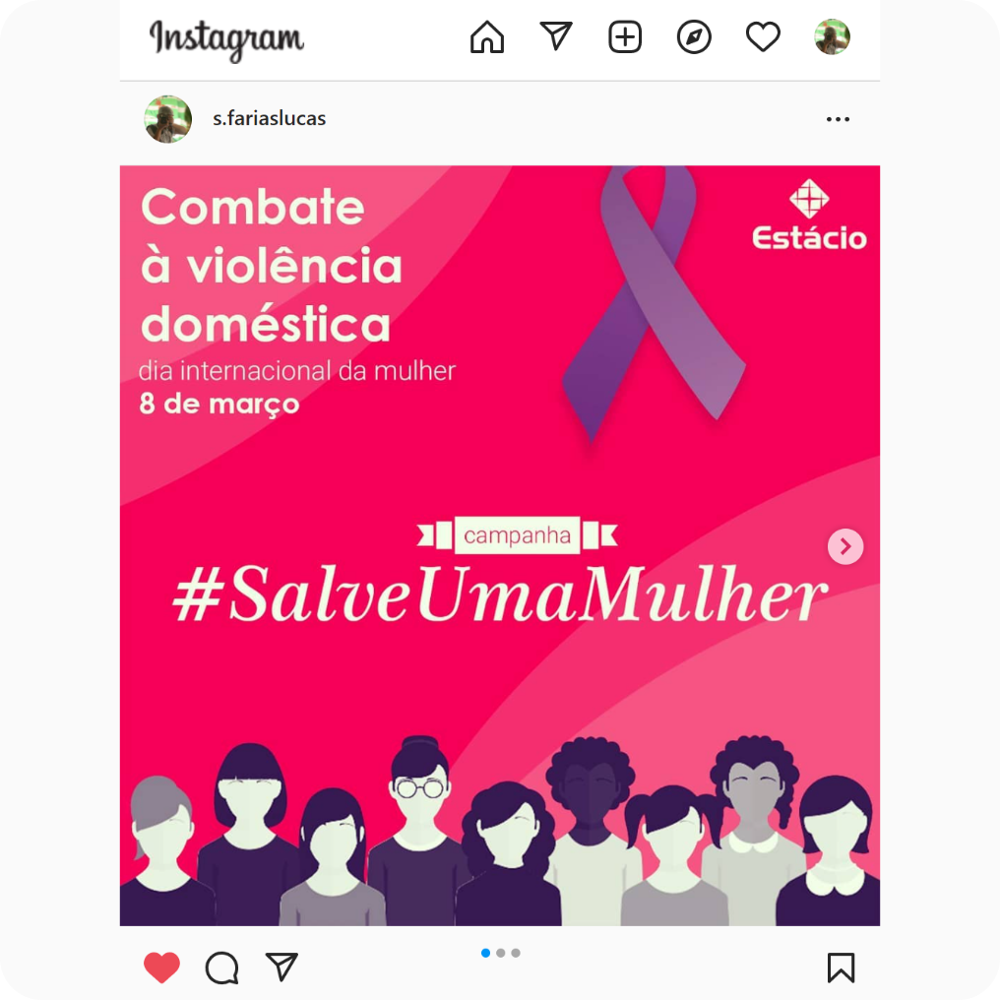
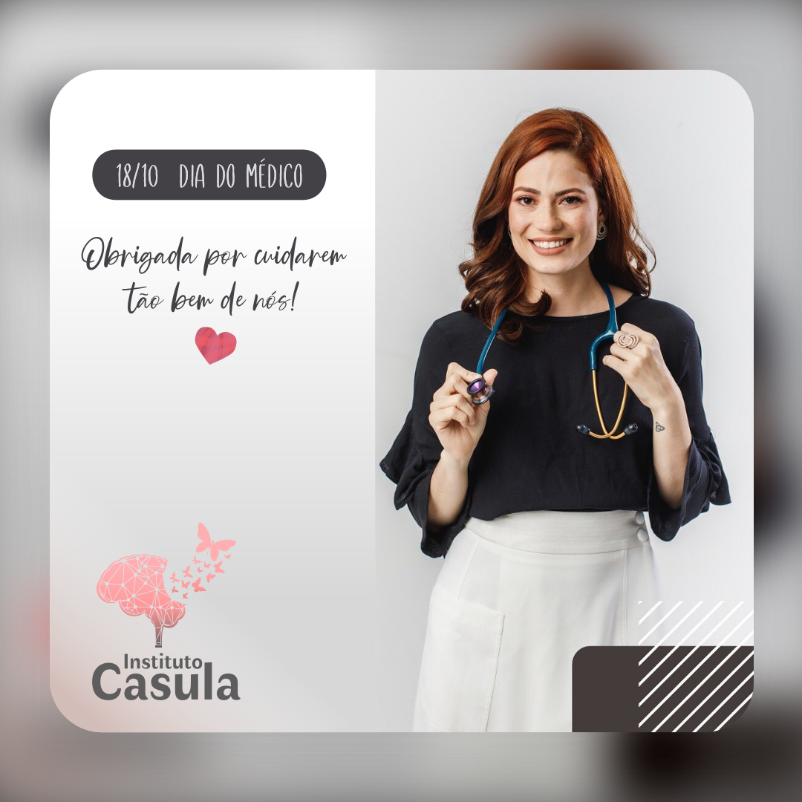
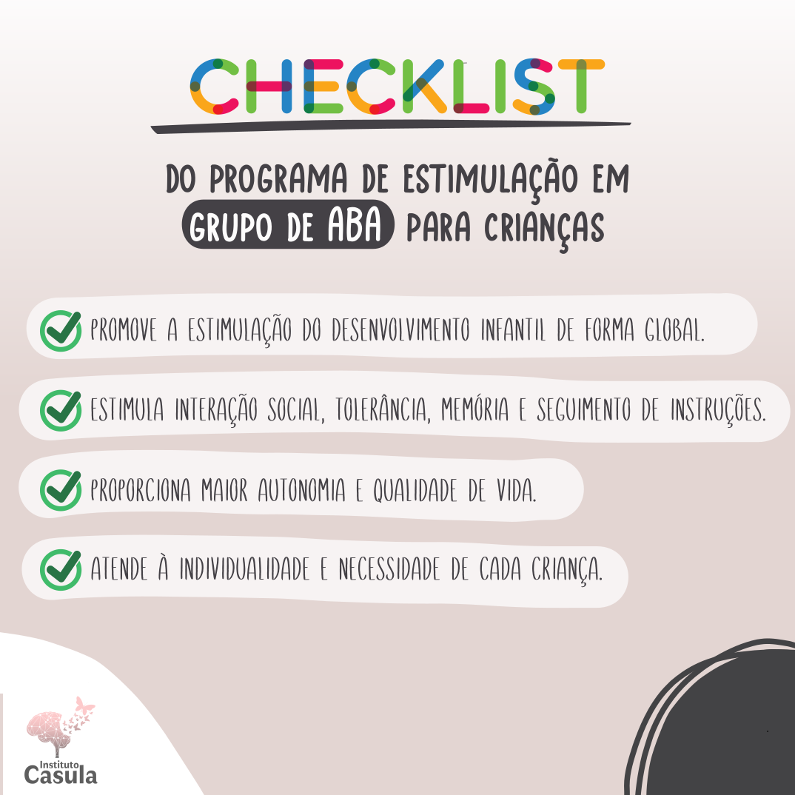
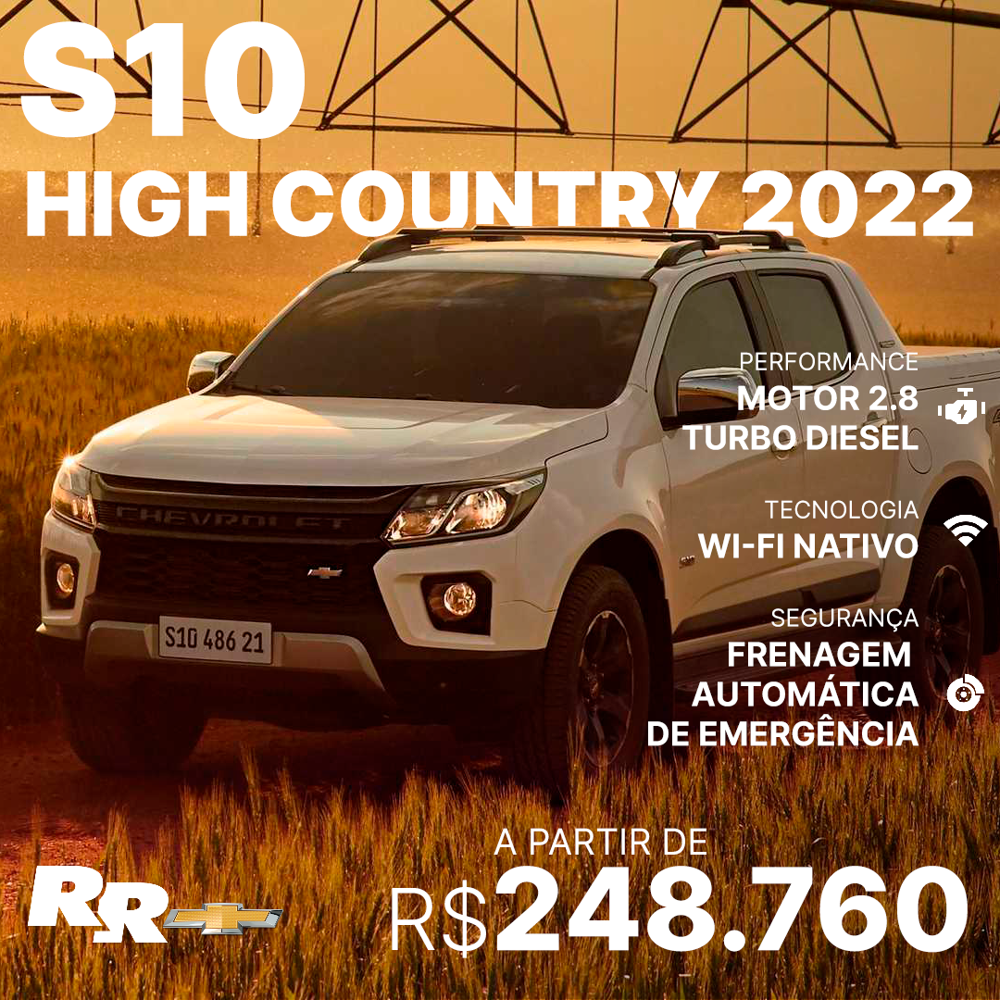

Adobe Illustrator, CorelDraw & Inkscape são **programas para edição, desenho e manipulação de gráficos vetoriais**. Estes tipos de gráficos são usados em tarefas que necessitam de um alto grau de precisão e quando informações complexas podem ser decompostas em simples formas geométricas. É o modelo preferido para áreas como engenharia, arquitetura, agrimensura, renderização 3D, e tipografia.


Campanha Mulher - Tema violência
Postagem Instituto Casula



  
  
Campanha Mulheres, 1

  
  
Campanha Mulheres, 2

 

  
  
Postagem Instituto Casula, 1

 

  
  
Postagem Instituto Casula, 2

 

  
  
Postagem RR Chevrolet, 1

 

  
  
Postagem RR Chevrolet, 2

 

   

## Habilidades

* Desenvolvimento de artes, figuras, logos, logotipos, banners, símbolos e ícones
* Desenvolvimento de mockups (websites, UI, posts)
* Tipografia

 

Interface do Inkscape

