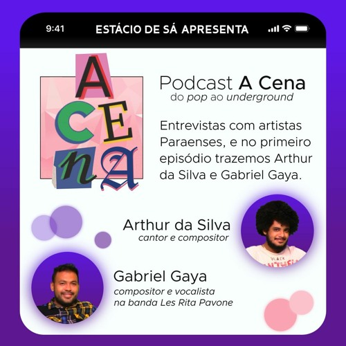

# Podcast A Cena

O Podcast A Cena é um projeto em que são entrevistados personalidades do cenário artístico paraense, _do pop ao underground_. No primeiro episódio, a _host_ Isis Bem entrevista o cantor e compositor Arthur da Silva e o também compositor Gabriel Gaya, vocalista na banda Les Rita Pavone. 


../assets/img/podcast_a_cena/a_cena_convidados.jpg
../assets/img/podcast_a_cena/a_cena_cover.png



<!---  --->

<!---  --->

<!--- Quer saber mais dessa cena? [Ouça o podcast completo no Spotify!](https://open.spotify.com/episode/04hvVIvF8Z80dPI0dmXTxt)
--->

<!---

--->

Quer saber mais dessa cena? <a target="_blank" href="https://open.spotify.com/episode/04hvVIvF8Z80dPI0dmXTxt">Ouça o podcast completo no Spotify!</a>

 

## Habilidades utilizadas no projeto

#### **Audacity**
* Limpeza e ajuste de áudio
* Corte de partes do áudio para otimização da conversa
* Adição de efeitos sonoros e músicas de fundo
* Balanceamento de volume

#### **Inkscape**
* Criação das artes de capa e de apresentação dos convidados

#### **GIMP**
* Edição das imagens dos convidados

#### **Outros**
* Desenvolvimento de roteiro

<!---



--->