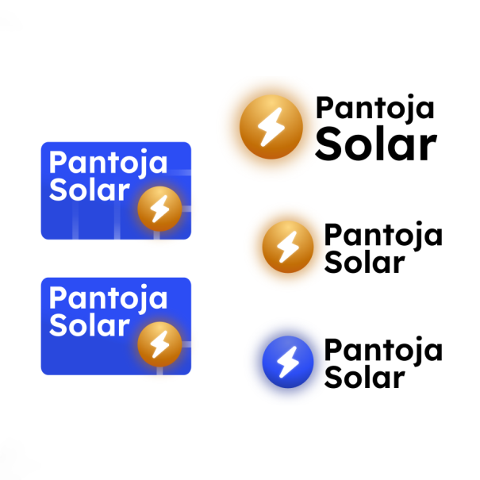

Desenvolvimento de logos, logotipos e documentos de identidade visual.

  
  
Pantoja Painéis, empresa de energia solar

  
  
Zenithar, empresa de recursos humanos

 

  
  
Solus, empresa fictícia de soluções tecnológicas

 

  
  
Solus, empresa fictícia de soluções tecnológicas

 

  
